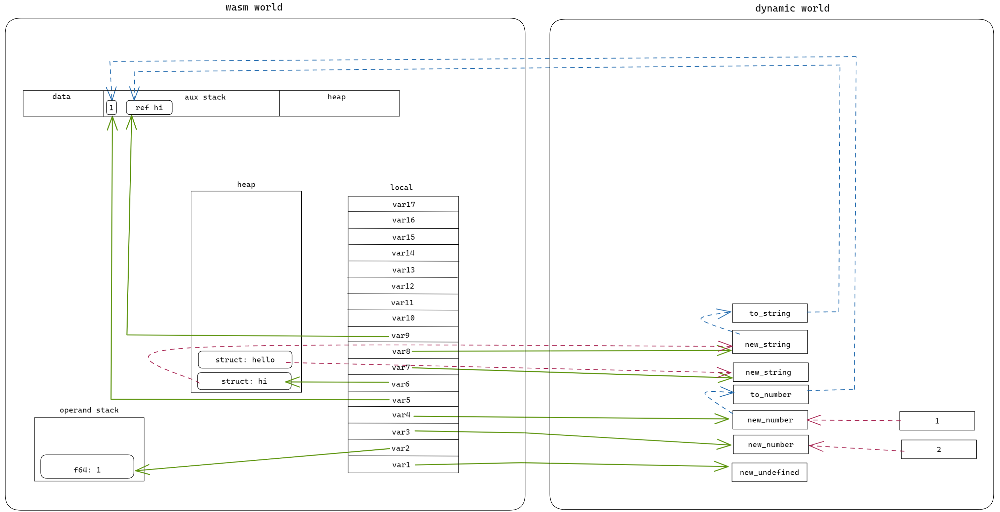
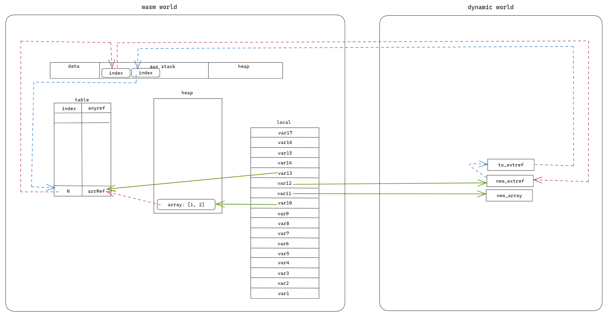
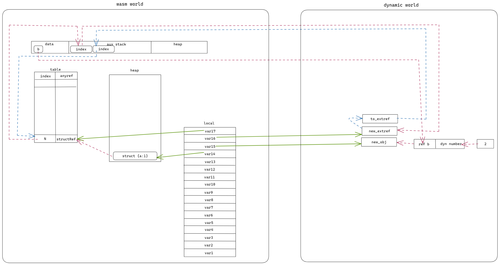

# ts2wasm dataflow with any
## basic
We designed and implemented a dynamic library to represent `any` type, it is independent of the wasm world. When the assignment of any type occurs, it will involve dataflow between the wasm world and the dynamic world.

According different data type, the dataflow is different.

## ts sample
```typescript
export function anyTest() {
    const var1 = undefined;
    const var2 = 1;
    const var3: any = 2;
    const var4: any = var2;
    const var5 = var4 as number;
    const var6 = 'hi';
    const var7: any = 'hello';
    const var8: any = var6;
    const var9 = var8 as string;
    const var10 = [1, 2];
    const var11: any = [3, 4];
    const var12: any = var10;
    const var13 = var12 as number[];
    const var14 = {a: 1};
    const var15: any = {b: 2};
    const var16: any = var14;
    const var17 = var16 as typeof var14;
}
```

## basic type


## array type


## class type

