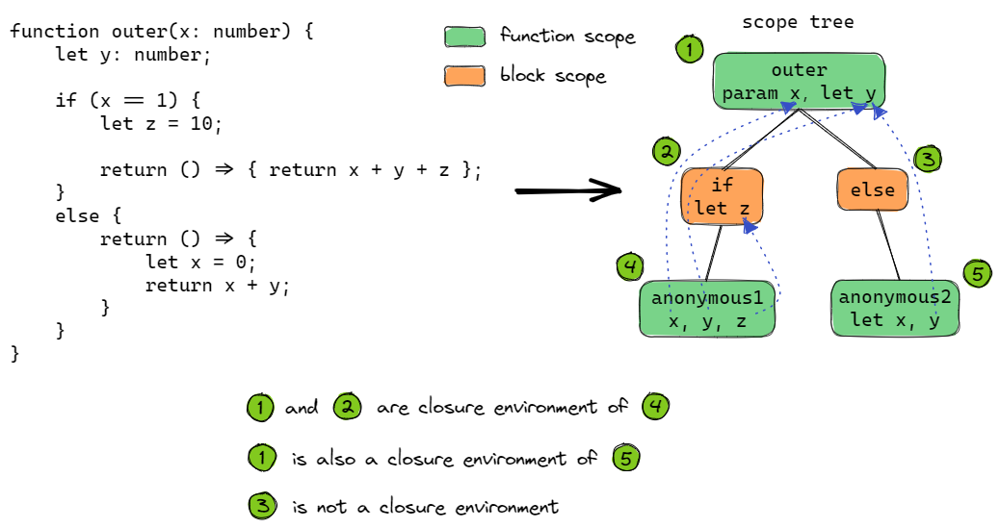
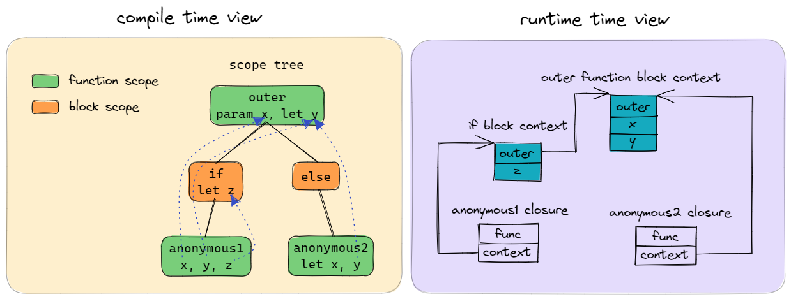

# ts2wasm closure design

## Closure representation

Closure is a combination of `function` and `data`, it can be represented as a wasm struct
- First field is a funcref to the closure function
- Second field is a reference to the closure context (which contains all the closed variables)

    ``` bash
    +-----------+
    |  funcref  | (function type)
    +-----------+
    |  context  | (anyref)
    +-----------+
    ```

## Closure detection

When finding a variable, if the variable's scope is outside of the function's scope, then this variable is a `closure variable` (aka `close variable`, `free variable`), and that scope is called `closure environment`

- Any `FunctionScope` or `BlockScope` can be a `closure environment`
- A closure may have multiple `closure environment`



## Closure context

Closure context is a struct with:
- First field as a reference to outer closure context
- Other fields stores the `closure variable` in that scope

    ``` bash
    +---------+
    |  outer  | (outer context type | null)
    +---------+
    |  var1   | (var type)
    +---------+
    |  var2   | (var type)
    +---------+
    |  ...    | (var type)
    +---------+
    ```

Every scope has a special variable `context`:
- If it's a `closure environment`:
    - A new `closure context` will be created and assigned to `context` variable
    - The `outer` field will point to outer scope context
    - The `closure variables` in that scope will be the field of the `closure context`
- Otherwise it's `context` is a reference to outer scope's `context`
- GlobalScope and NamespaceScope's context will always be `null`, variables in GlobalScope and NamespaceScope will be treated as global variable



> Question: Can loop have the same behaviour?

### Outer context

Every scope need to know its outer scope's context
- For function scope (except class method), reserve the first parameter to receive outer scope's `context variable`
- For block scope, there will be a map in the corresponding function scope to record the map between scopes and their `context variables`
- When invoking a function, always pass current scope's `context variable` as the first parameter
- For top-level exported function, there will be a wrapper without the reserved parameter, which invoking the original function with null context.

> Q: Why we need to add reserved parameter to every function?
> A: Every function (even top-level function) may become a closure, we need a unified calling convention for both direct and closure call

> Note: the type of `funcref` in closure struct will contain the reserved parameter for context variable.

### Loop condition

A loop statement typically has three parts:
- Loop initializer: initialize condition variables
- Loop header: check conditions
- Loop body: logic inside loop
- Loop finalizer: update condition variable

``` webassembly
block
    ;; Loop initializer
    loop $l
        ;; Loop header
        if
            ;; Loop body
            ;; Loop finalizer
            br $l
        end
    end
end
```

If loop block is a closure environment, the closure context will be created in every iteration. There are two solutions:
1. Create new context in `Loop initializer` and `Loop finalizer`
    - The last created context is dropped since it will not be used
    - In `Loop finalizer` get condition variables from old context, and set the new values to new context
2. Create new context in begging of `Loop body`
    - Condition variables should be locals, they will be copied to context when the context created
    - In `Loop finalizer` copy the condition variables from context to locals

## Closure creation

Closure is created when a function is coverted to a reference, e.g:
- Assign a function to a variable / parameter / field
- Push function to an array
- return a function

## Closure invoke

Invoking a closure require these steps:
1. Get funcref from closure struct
2. Get context ref from closure struct
3. Use `callref` to call the funcref and use context ref as the first parameter

## Closure function logic

If a function uses closure variables, then:
1. It will cast the context variable to concrete type calculated at compile time
2. Access closure variables from the context rather than locals

## Notice

1. Default parameter is not recorded in the function type, when it becomes a closure, the default parameter will be lost
2. If the function has closure variable from several different scopes, then the context variable may become very complex, and the variables from the farthest scope will have the worst access efficiency
