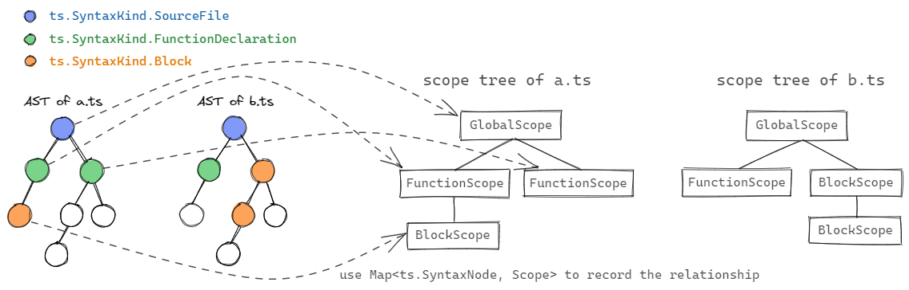

# ts2wasm scope tree design

## Basics

Scope is a basic unit for managing variables, there are several kinds of scopes in TypeScript. In ts2wasm, every kind of scope has a corresponding class in compiler source code:

| TypeScript scope | class in ts2wasm |
|  :---:    |   :---: |
| module scope | GlobalScope |
| namespace scope | NamespaceScope |
| funtion scope | FunctionScope |
| class scope | ClassScope |
| block scope | BlockScope |

- All these classes are inherited from a common base class `Scope`.
- The Scopes consists a tree-like structure (`scope tree`), the `GlobalScope` is always root of the tree.
- `GlobalScope` can contain any other scopes
- `NamespaceScope` can contain any scopes except `GlobalScope`
- `FunctionScope`, `ClassScope` and `BlockScope` can contain each others
- If there are multiple modules(files) participate compilation, there will be scopes trees for every module(file).

## Scope Creation

The scopes are created during the first pass `ScopeScanner`. The `ScopeScanner` traverse the whole AST generated by tsc, and create scopes follow these rules:
- For every `scope related SyntaxNode`, create a new scope and append to parent scope's children list.
- Use a HashMap to record relationship between AST node and scope.

`Scope related SyntaxNode` includes:

- ts.SyntaxKind.SourceFile (GlobalScope)
- ts.SyntaxKind.ModuleDeclaration (NamespaceScope)
- ts.SyntaxKind.FunctionDeclaration (FunctionScope)
- ts.SyntaxKind.FunctionExpression (FunctionScope)
- ts.SyntaxKind.ArrowFunction (FunctionScope)
- ts.SyntaxKind.ClassDeclaration (ClassScope)
- ts.SyntaxKind.SetAccessor (FunctionScope)
- ts.SyntaxKind.GetAccessor (FunctionScope)
- ts.SyntaxKind.Constructor (FunctionScope)
- ts.SyntaxKind.MethodDeclaration (FunctionScope)
- ts.SyntaxKind.Block (BlockScope)
- ts.SyntaxKind.ForStatement (BlockScope)
- ts.SyntaxKind.WhileStatement (BlockScope)
- ts.SyntaxKind.DoStatement (BlockScope)
- ts.SyntaxKind.CaseClause (BlockScope)
- ts.SyntaxKind.DefaultClause (BlockScope)



For every SyntaxNode in the AST, it can traverse back towards the root direction, and when it meet a node which is recorded in the nodeScopeMap, then current SyntaxNode belongs to that scope.

## Scope content

- Every scope records its **parent scope** and an **array of child scopes**
- Every scope has a **variable array** to record variables defined in this scope
- Every scope has a **namedTypeMap** to record types defined in this scope
- Every scope has a **statement array** to record statements in this scope
- `GlobalScope` additionally records the **module's name**, and **import module information**
- `ClassScope` additionally records the **class's name and type**
- `FunctionScope` additionally records the **function's name, type** and an **array of parameters** as well as **other function informations**

## Variable resolver

``` typescript
// GlobalScope
import { c } from 'b.ts'

function foo() {
    // FunctionScope "foo"
    let x = 1;
    const bar = (y: number) => {
        // FunctionScope "bar"
        return x + y + c;
        // y is in scope "bar"
        // x is in scope "foo"
        // c is in b.ts's GlobalScope
    }
}
```

1. Traverse current scope's variable array, if found `Variable` with given name, return this `Variable`, otherwise goto 2
2. If current scope is `FunctionScope`, traverse the parameter variable, return if found, otherwise goto 3
3. If parent scope not null, enter parent scope and goto 1, otherwise goto 4
4. assert current scope is GlobalScope, traverse the import information map, if exists, get `Variable` from that module's `GlobalScope`, otherwise return null

## Function resolver

1. Traverse current scope's child scope array, if found `FunctionScope` with given name, return this `FunctionScope`, otherwise goto 2
2. If parent scope not null, enter parent scope and goto 1, otherwise goto 3
3. assert current scope is GlobalScope, traverse the import information map, if exists, get `FunctionScope` from that module's `GlobalScope`, otherwise return null

> Question: How to deal with the start function? Seems we don't need to resolve the start function since it can't be invoked in the source code?
