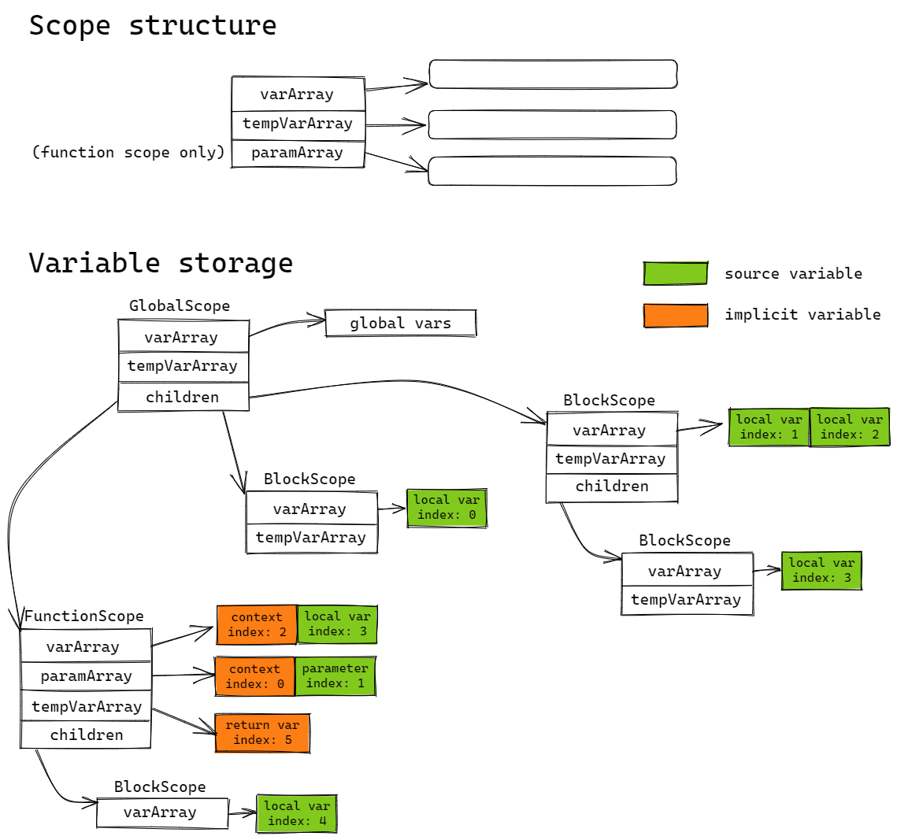

# Variable index assignment

WebAssembly doesn't have block scope locals, index must be manually assigned by compiler.

There are three kinds of variables:

- local variable
    - Access through unique index in function scope
    - Block scope variable inside function scope will be the function's local
    - Block scope variable inside global/namespace scope will be a global variable

- closure variable
    - Access through field index inside closure context struct

- global variable
    - Access through unique index in global scope
    - binaryen provide mechanism to access by unique name, so we don't need to assign index

## When to assign

Compiler may insert some implicit variables during processing, including:

- `context variable` for every function and block scope
- `return variable` for function scope (if any)
- `temporary variable` during code generation

Variables defined in source code called `source variable`.

- After variable resolver, traverse scope tree for every function/global scope and assign the index for `context variable`, `return variable` and `source variable`
    - for global scope, variables inside child block scopes will be assigned, variables in global scope itself is treated as global variable and don't have a local index
- The start index is length of parameter array, or 0 for global scope (start function takes 0 parameter)
- The `temporary variable` is dynamically added to the scope and index is allocated from the corresponding function or global scope
- Scope have two states: `indexAssigned` and `indexUnAssigned`
    - in `indexUnAssigned`, can add any `Variable` or `Parameter` into that scope, and the index of those variables will be automatically calculated later (this works for `context variable`, `source variable`)
    - in `indexAssigned`, can't add `Variable` and `Parameter`, introduce a new array `tempVarArray` to store dynamically created variables (through API `addTempVar`), the caller must call `allocateLocalIndex` API to get a valid index and assigned to that newly created variable (this works for `return variable` and `temporary variable`)

## Sketch map

